**SMC TRADING NOTES**

The market only does two things: **1)** Seeks liquidity from previous
highs or lows, or **2)** seeks to rebalance FVGs (Fair Value Gaps) also
known as an “imbalance” of price.

| **Internal liquidity = FVG (Fair Value Gap)** | **External liquidity = Swing High/Low** |
|----|----|

**The Flow:** After taking out external range liquidity, price will then
look for Internal range liquidity.

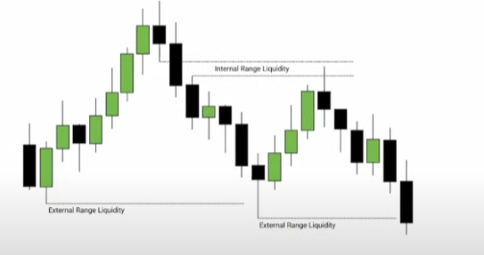

**FVG (Fair Value Gap)**

When three candles (any TF) are created and the body and wicks of the
first and third candles don’t overlap, this creates an “imbalance” in
price called an FVG. The FVGs usually attract price and they get filled
eventually.

- FVG are **not to be used as support and resistance levels**, unless
  they have confluence with other levels. Best setups are when IFVGs are
  created (see below).

- Two FVGs – if one FVG is created close to another, use the second FVG,
  or go to a TF where both FVG are shown as one.

- Usually you will see that an Order Block is present belove or above
  the FVG depending on the direction of the price movement.

- FVG = Inefficiency \| FVG = Displacement ( price gets “displaced”
  higher or lower leaving inefficiency).

**IFVG** (**Inverted Fair Value Gap)**

Price moves back into and thru the previously created FVG, then the
candle **body** (not just the wick) closes outside of the FVG. This is
now an **IFVG** (Inverted Fair Value Gap).

- **IFVGs are considered A+ trade setups** – Entry = just get in after
  the 1min or 5min TF candle closes outside of the IFVG. The FVG must
  get disrespected to become an IFVG.

<!-- -->

- A retest may not happen so just enter with a market order and apply a
  stop at the middle or top of the IFVG.

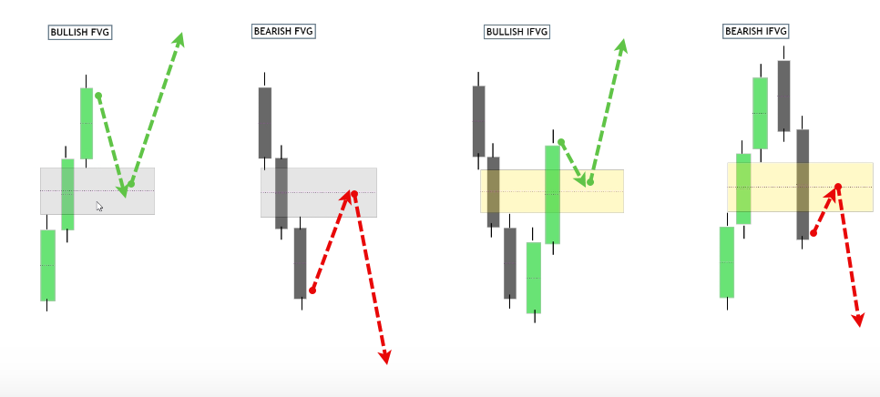

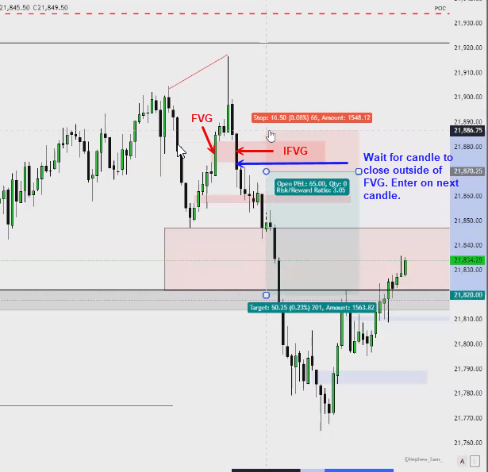

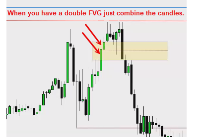

**Break Away Gap**

A three-candle formation same as an FVG, but the **third** candle is a
large momentum candle similar to the **second** candle. This shows
strong momentum, so price may not return to fill the the FVG right away.
Eventually all gaps get filled for the most part.

- This is a sign of strong momentum and not a trade setup by itself.

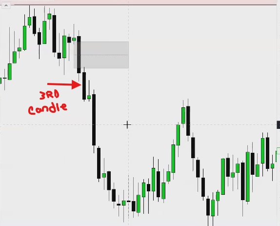.

**SMT (Smart Money Technique)**

When two highly correlated indexes such as **ES & NQ** or **Gold &
Silver** shows a difference in price levels, this called divergence and
its is a strong confluence signal. We call this a “crack in
correlation”. For example, **ES** makes a higher high at a key
resistance level, but **NQ** does not. This is a sign of strength for ES
and weakness for NQ. Since price is at a key resistance level, choose
the weaker index (NQ) and use your entry model to look for a **short**.

**PRO TIPs:**

- **DO NOT** take a reversal trade without an SMT as confluence,
  **period!!!**

- If price is at a **support key level** in your trading plan, look to
  go **long** on the **stronger index**.

- If price is at a **resistance key level** in your trading plan, look
  to go **short** on the **weaker index**.

- **SMT** inside an FVG being used as support or resistance is an A++
  setup – follow the same process as above.

- Use the **15, 5 or 1min** TF for mapping out the SMT. Every trade you
  take should be supported by SMT formation.

- Again, **DO NOT** take a reversal trade without an SMT as confluence,
  **period!!!**

- Your A+ setups become A++ when SMT is used as
  confluence.

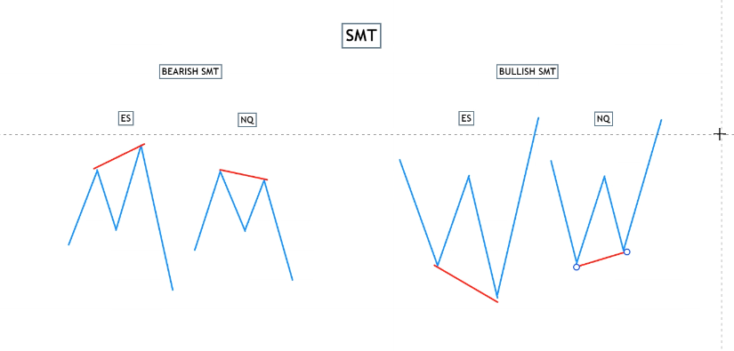

SMT Example with YM, ES and NQ

- Since the trend was bullish, this SMT showed you that price will
  respect the FVG, it will hold, and you can confidently trade the
  stronger index (NQ) in the direction of the trend = **Long**.

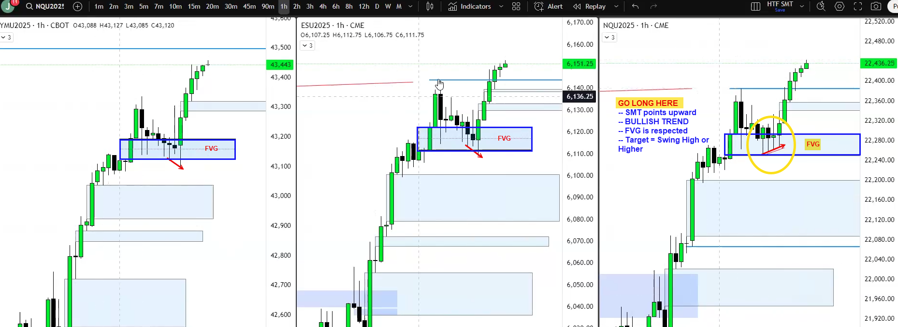

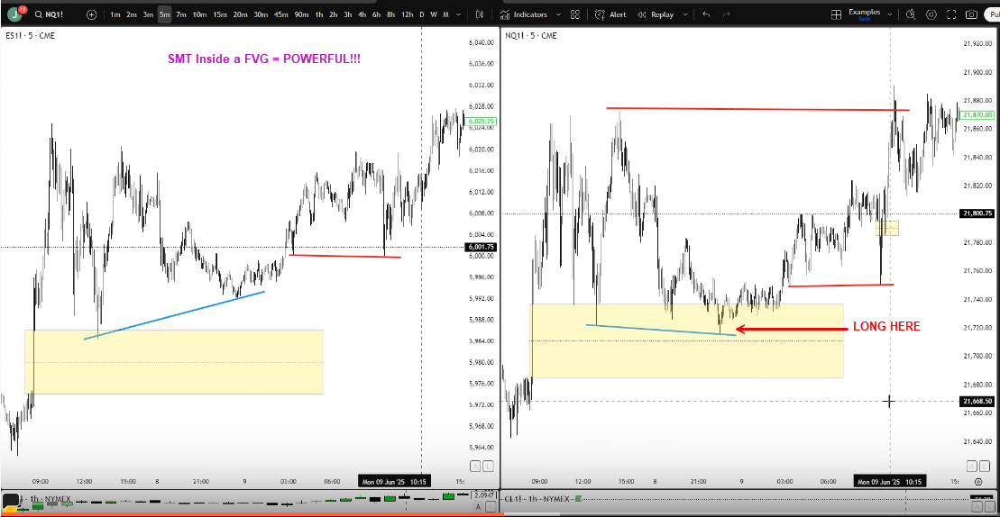

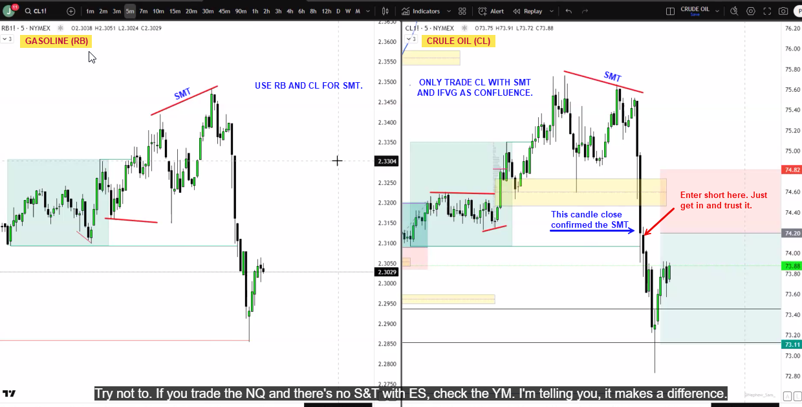

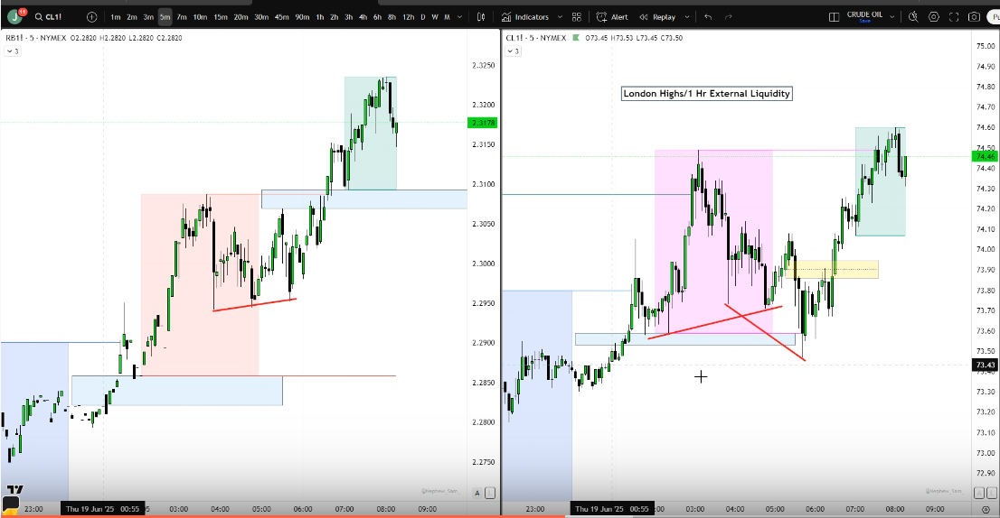

**Order Blocks (OB)**

An Order Block is a single or series of candles which moves above or
below a strong key level and clearly shows the beginning of a strong
reversal move up or down. In other words, the candle(s) just before a
strong move up or down which take out a key level.

**Key Levels:** PDH/PDL, London/Asia H/L, FVGs, Swing H/L, etc.

- A valid OB can **ONLY** be formed **AFTER** a “key level” has been
  taken out. If it was formed at some random spot/level on the chart it
  has a lower probability of being respected.

- The **BEST** order blocks are the ones which create inefficiency -
  strong moves which create **FVGs**.

- OBs Must create a “**break of structure**” – look left to see if a
  level is being broken and the candle closes above that level.

- The OB must be unmitigated – only use a fresh OB (one time use only).

- Highest probability in a **trending market**, not a ranging market.

- Go **with the trend** most of the time to create A+ setup.

- Volatility and volume are needed to create the best OBs for trading.

- Although this works on any TF, use the **1h and 15m** to create your
  OBs.

**OB Trade Entry:**

If the above criteria are met here is the execution:

1)  Price must close above the **WICK** of the OB candle.

2)  Price must then come back to retest the **BODY** of the OB candle.

3)  Determine if there is a min **2:1 or greater** risk to reward to the
    next key level liquidity area

4)  **SL** should be placed below the OB candle wick

5)  **\*\* Note:** If there is a FVG in the OB area, price may want to
    test it before making its move so use your FVG rule in this case.

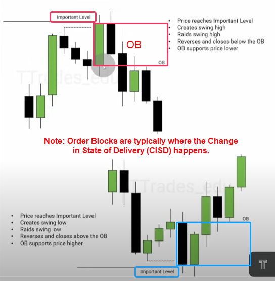

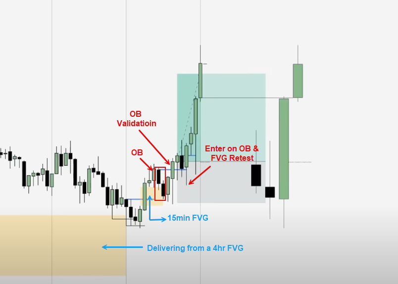

**CISD (Change In State of Delivery)**

**Watch/wait for manipulation** – liquidity sweep, etc. - price should
move up or down to take out a key level then reverse. Price then moves
to take out the swing point where the initial move started from, either
from a series of candles or one large candle. When a candle **closes**
above that swing point (structure), then the “**State of Delivery**” has
changed. Look for an entry to join the trend after a retest.

- This constitutes a change in the market structure and acts as
  confirmation that price is moving out of the current level or range.

- Do not count the wicks as a part of the structure level, only the open
  and close of the bodies.

- **Entry (1 min TF)** – safest entry is to wait for a retest.

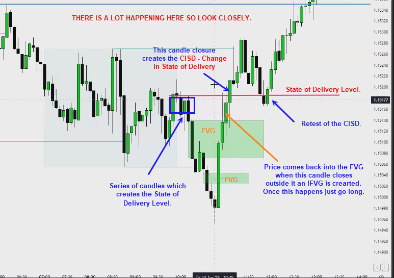

| 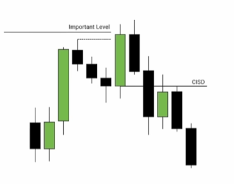 | 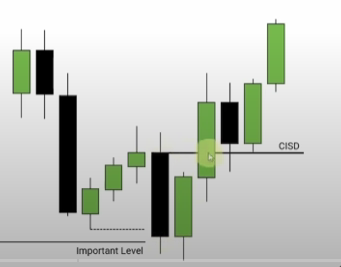 |
|----|----|

**AMD - Accumulation \> Manipulation \* Distribution**

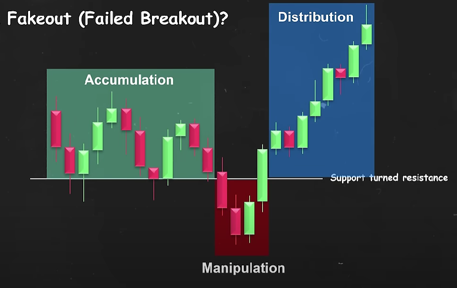

**Accumulation**

- Price consolidates without a clear direction up or down. It usually
  creates equal highs and lows and trades in a “rectangular box” or a
  “channel”, collecting liquidity at the tops and bottoms of the range.
  I’m sure they make money from retail traders trying to “front run” the
  breakouts from here.

**Manipulation**

- Price executes a fake breakout (“fakeout”) to induce breakout traders
  then, sweep their liquidity before reversing in the other direction.

- Price MUST breakout of the box and close, then trade back into the box
  and close.

- In other words, you are NOT trading in the direction of the breakout,
  you are trading in the opposite direction.

- This price action can be some of the best trade setups since its
  potentially the start of the “Distribution” phase of the AMD model.

**Distribution**

- Once you see the liquidity sweep, you can expect a nice move in the
  distribution phase.

**Entry**

- Wait for the price to breakout of the consolidation box and close,
  then trade back into the box and close.

<!-- -->

- Take your trade into the box and wait for it to breakout of the other
  side. If you are with the trend that is good confluence.

- If price moves too fast for you to enter, wait for a retest of an OB
  or top/bottom of the consolidation box to enter later.

- AMD is more powerful when combined with HTF Key Levels or other
  methods.

> **Examples:**

| 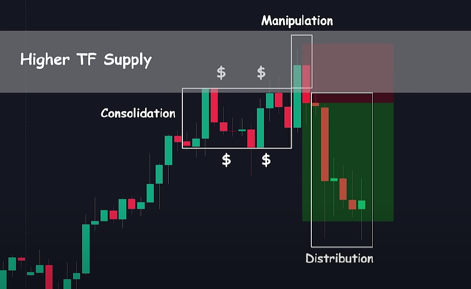 | 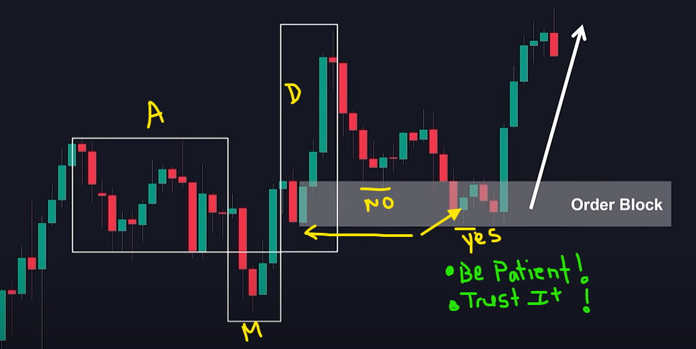 |
<!-- |----|----| -->

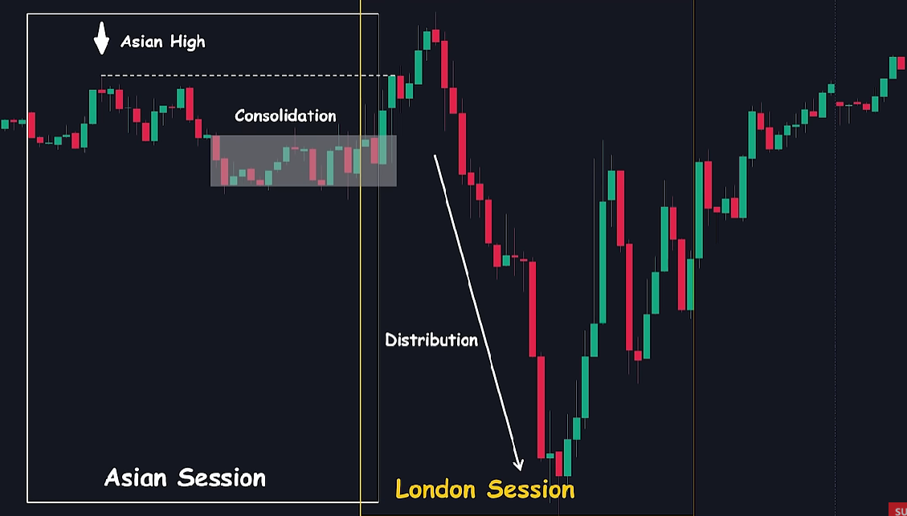

**Terms:**

- **Consequent Encroachment**: The middle of the FVG

- **Displacement:** when an FVG is not respected and price moves thru
  it.

**Pro Tips:**

Get good at seeing pools of liquidity before and after they are taken.
This means you need to observe the following on the charts.

- **Double Tops/Bottoms \| Key Levels \| FVG/IFVG \| Order Blocks \|
  Hammers \| CISD**

- Be active and dynamic with drawing and mapping out these levels to see
  if a trade can be structured.

- Stay with the 1hr and 15min TF since its working for you. Sprinkle in
  some 5min setups also.

- [Journal trades for 2-3 months, separating trades with SMT vs without
  SMT to analyze win
  percentages](https://email.notification.circle.so/c/eJwsjr2K4zAYAJ_G7mQ-SZ9kqVARMIHjquOKg2uCfh0Ty8pacpbk6Zcs20wxTDG-5HxsS3telmAoQ055H4xET8fQR0NHASgAGPRXo5JWowbKESGidIA48uipxxGl02O_GKmEcEmiVMqlC2WcWgaKMQZSsw4hxPtanjlujTjrb_Neji2QEJM91kaUdl5J5x1x-2v_GLJd1n4119buteOnjp07dj4qyGbrrQ6vUvJw1Lfm5xxjW7b5V-j4NP0O6W8u-c__fyGt0-mB2-c0d0zw6Qeytnj_bqVMCnTwBCOMhNIERFvOiWbBC6GDQmX73dyWaq2vokOY31uDL7l_GPYVAAD__w7yX8A)

- [When trading NQ and ES pairs, prioritize trading the weaker asset
  when shorting and the stronger asset when going
  long](https://email.notification.circle.so/c/eJwsjj2L4zAUAH-N3ck8PUnPcqEiYALHVccVB9cEWR-OiWVlLTlL8uuXLNtMMUwxLqd0bEt9XhZvOErBResNScd73wbDewVSASC0V6O1Be5ijwS9G4RDTZ5iED352FtJ7WJIKzVFkqT1FC8cBbcIGhGBBmwk-HBf8zOFrbLJutu852PzzIdoj7UyPUxO0-QmNu2v_aNLdlnb1VxrvZdGnBo8N3g-ClC15Va6V86pO8pbi3MKoS7b_Ms3Yhx_-_g35fTn_z8f1_H0kNvnODeoxPgDKjXcv1uiqDmQYzJAzziPwAYrBBvQO6UGr6W27W5uS7HWFdVImN9bncupfRj8CgAA___I9GBN)

- [Wait for the second fair value gap to be inverted when encountering
  double fair value gaps, unless trading at a key area with
  SMT](https://email.notification.circle.so/c/eJwsjr2K4zAYAJ_G6mQ-ffqxXKgImMBx1XHFwTVBv46JZWUtOUvy9EuWbaYYphhfcj62pT0vSzAMBWecBKOEZ0Mg0bBBgpAACORqBs4DePCorY9qYFJwlqSX2gkPbLBkMUpL6ZISSmuXLgw5swgaEUGN2AkI8b6WZ45bo87627yXYws0xGSPtVE9Oq-V8466_bV_9NkuK1nNtbV77fipw3OH56OCarbeav8qJfdHfWt-zjG2ZZt_hY5P0--Q_uaS__z_F9I6nR5i-5zmDiWffqBqi_fvVqmkmQBBRYSBMpaAjpZzOmLwUo5BC23Jbm5LtdZX2QmY31u9L5k8DH4FAAD__54cX_o)

- [Only enter trades with market orders rather than limit orders to
  ensure
  execution](https://email.notification.circle.so/c/eJwsjr2K4zAYAJ_G7mSkT3-fCxUBEziuOq44uCbo1zGxrKwlZ0mefsmyzRTDFONLzse2tOdlCYaB4Iz3wSjhmQ59NExLKiSlQPurYToFxahQgntIGkXyyLjy1KMYNWK_GIVSuqSEQnTpwoAzCxQBgKoROkFDvK_lmePWiLP-Nu_l2AIJMdljbQRH51E574jbX_vHkO2y9qu5tnavHT91cO7gfFSqmq23OrxKycNR35qfc4xt2eZfoePT9Dukv7nkP___hbROp4fYPqe5A8mnH6ja4v27VSoh0xGIiFQTxhIlo-WcjBC8lGNAgbbfzW2p1voqO0Hn99bgS-4fBr4CAAD__z0FX8M)
